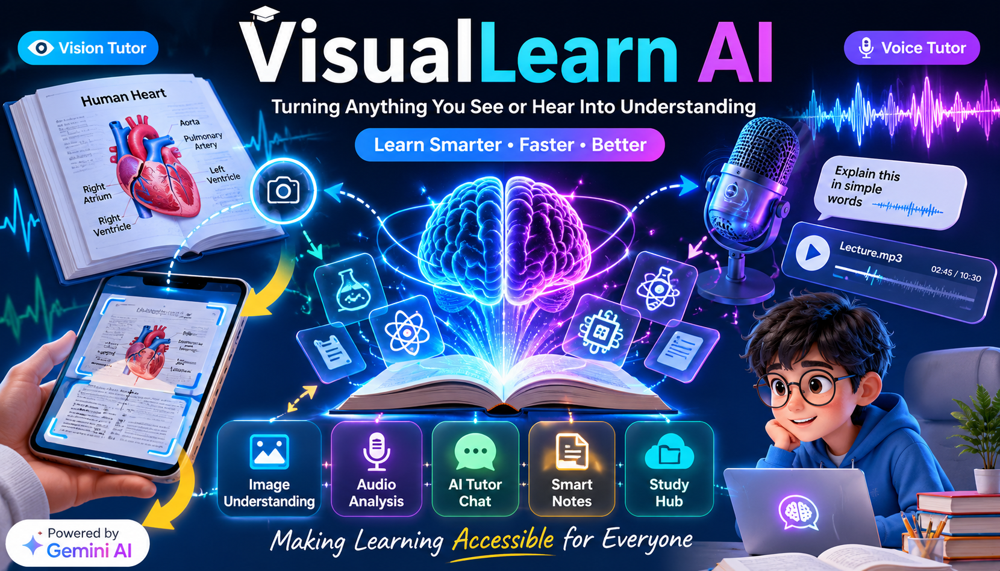

# VisualLearn AI

> Transform images, diagrams, textbooks, and audio into personalized learning experiences with AI.



## Overview

VisualLearn AI is an AI-powered educational platform that helps students understand complex learning materials through visual analysis, audio processing, and interactive tutoring.

The platform allows users to upload textbook pages, diagrams, notes, screenshots, and audio recordings, then receive simplified explanations, structured breakdowns, and personalized learning assistance powered by Gemini AI.

## Features

### 👁️ Vision Tutor

Analyze visual learning content including:

* Textbook pages
* Diagrams
* Charts
* Notes
* Screenshots
* Educational images

Get:

* Simple explanations
* Diagram breakdowns
* Key concepts
* Learning insights
* AI-powered tutoring

### 🎤 Voice Tutor

Learn from audio content.

Supports:

* Audio uploads
* Lecture recordings
* Voice questions
* Speech-to-text
* AI explanations
* Text-to-speech playback

### 📚 Study Hub

Manage and organize learning materials.

Features:

* Saved learning sessions
* Notes management
* Bookmarks
* Activity history
* Search functionality
* Export tools

### 🤖 AI Tutor

Interactive AI learning assistant capable of:

* Answering questions
* Explaining concepts
* Simplifying difficult topics
* Providing personalized guidance

## Tech Stack

### Frontend

* React.js
* JavaScript (ES6+)
* HTML5
* Tailwind CSS
* Vite

### AI

* Google Gemini API

### Browser APIs

* Web Speech API
* Speech Recognition API
* Speech Synthesis API
* Local Storage API

## Getting Started

### Prerequisites

* Node.js 18+
* Gemini API Key

### Installation

Clone the repository:

```bash
git clone https://github.com/maisamabbas0323/VisualLearn-AI.git
cd VisualLearn-AI
```

Install dependencies:

```bash
npm install
```

Start development server:

```bash
npm run dev
```

Build for production:

```bash
npm run build
```

## Configuration

VisualLearn AI stores the Gemini API Key locally inside the browser.

1. Open the application
2. Navigate to Settings
3. Enter your Gemini API Key
4. Save configuration

No backend setup required.


## How It Works

### Vision Tutor Flow

1. Upload image
2. AI analyzes content
3. Generate explanation
4. Review learning insights
5. Save to Study Hub

### Voice Tutor Flow

1. Upload audio or use microphone
2. Convert speech to text
3. Analyze content with AI
4. Generate explanations
5. Save learning session

## Accessibility

VisualLearn AI is designed to make learning more accessible through:

* Simplified explanations
* Voice interaction
* Text-to-speech
* Speech-to-text
* Responsive design
* Keyboard accessibility

## Challenges

Some challenges encountered during development included:

* Integrating image analysis workflows
* Handling browser speech APIs
* Managing AI-generated content
* Designing an intuitive learning experience
* Building a fully client-side architecture

## Future Improvements

* PDF support
* Multi-language learning
* Mobile application
* Learning analytics
* Advanced note organization
* Collaboration features

## Built For

Moonshot Hackathon 2026

## Creator

**Maisam Abbas**

Built with a passion for making learning more accessible, interactive, and personalized through AI.

## License

MIT License

